# Manual Técnico - Proyecto 1: NetCore Academy
## Redes de Computadoras 1 - Universidad San Carlos de Guatemala
### Joaquin Emmanuel Aldair Coromac Huezo
### Carnet: 201903873

---

## Índice
1. [Topología Completa](#1-topología-completa)
2. [Topología por Edificio](#2-topología-por-edificio)
3. [Tabla de VLANs](#3-tabla-de-vlans)
4. [Tabla de Direccionamiento IP](#4-tabla-de-direccionamiento-ip)
5. [Dominios de Colisión](#5-dominios-de-colisión)
6. [Dominios de Broadcast](#6-dominios-de-broadcast)
7. [Configuración de Dispositivos](#7-configuración-de-dispositivos)
8. [Pruebas de Ping](#8-pruebas-de-ping)
9. [Capturas de Verificación](#9-capturas-de-verificación)
10. [Presupuesto Estimado](#10-presupuesto-estimado)

---

## 1. Topología Completa

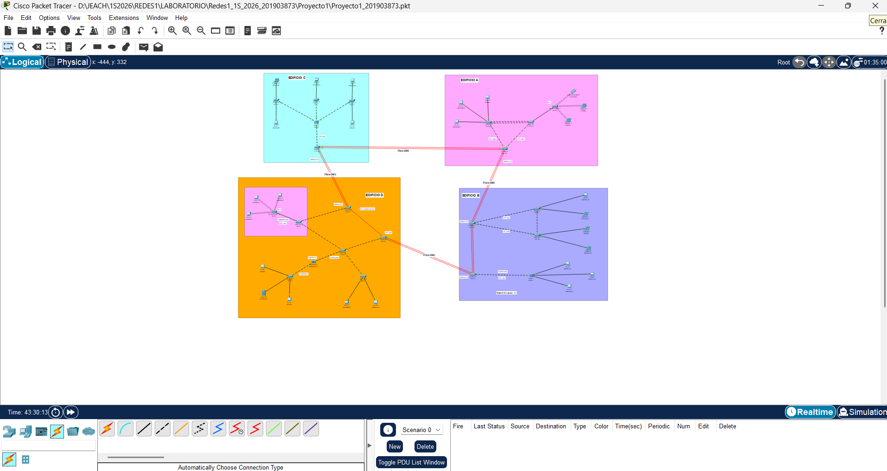

La topología consiste en 4 edificios (A, B, C, D) interconectados mediante enlaces de fibra óptica OM3 (100Base-FX). Se utilizan tres niveles jerárquicos de medios:

| Nivel | Medio | Interfaz | Uso |
|-------|-------|----------|-----|
| Interconexión de edificios | Fibra óptica OM3 (100Base-FX) | FastEthernet (módulo fibra) | Backbone entre edificios con EtherChannel |
| Distribución de edificio | Cobre UTP Cat6 | FastEthernet/GigabitEthernet | Trunks entre switches dentro del edificio |
| Acceso a usuarios | Cobre UTP Cat5e | FastEthernet | Conexión de dispositivos finales |

---

## 2. Topología por Edificio

### Edificio A
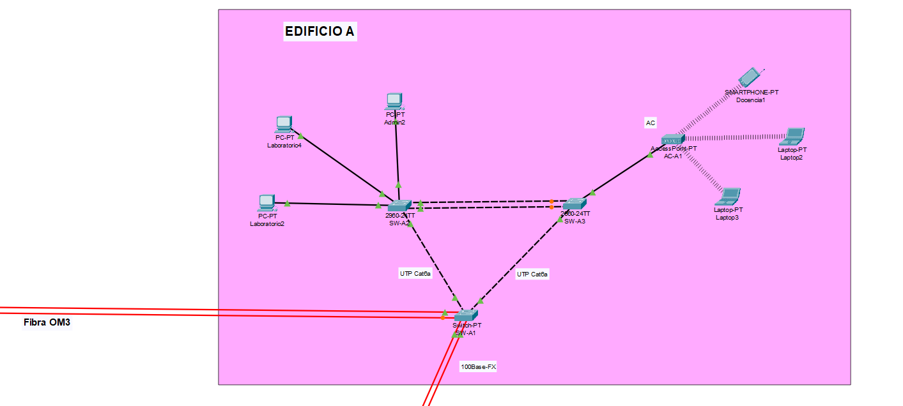

**Estructura:**
- SW-A1 (Switch-PT): Switch de distribución/backbone, VTP Server, Root Bridge
- SW-A2 (2960-24TT): Switch de acceso
- SW-A3 (2960-24TT): Switch de acceso
- AC-A1 (Access Point): Conectividad WiFi para VLAN Docentes
- EtherChannel LACP entre SW-A2 y SW-A3 (Port-channel 6)

### Edificio B
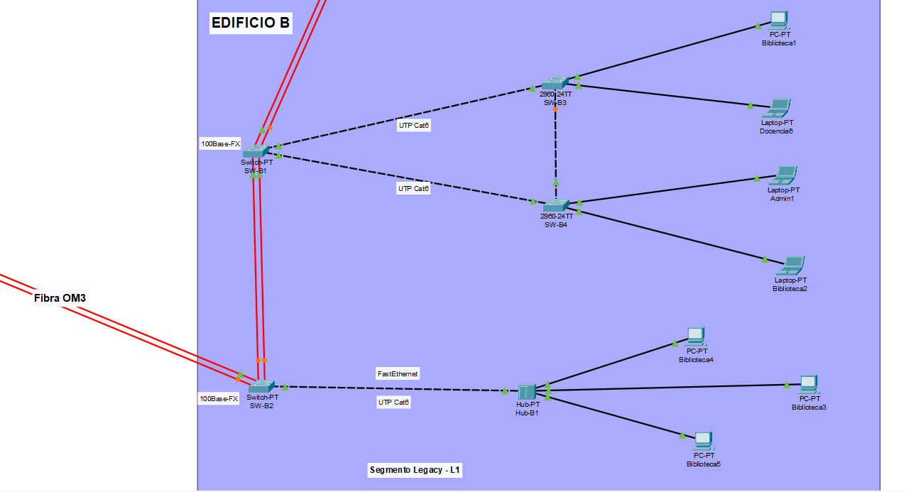

**Estructura:**
- SW-B1 (Switch-PT): Switch de agregación
- SW-B2 (Switch-PT): Switch de agregación
- SW-B3 (2960-24TT): Switch de acceso
- SW-B4 (2960-24TT): Switch de acceso
- Hub-B1 (Hub-PT): Segmento Legacy L1 — dispositivos comparten dominio de colisión
- EtherChannel PAgP entre SW-B1 y SW-B2 (Port-channel 5)

### Edificio C
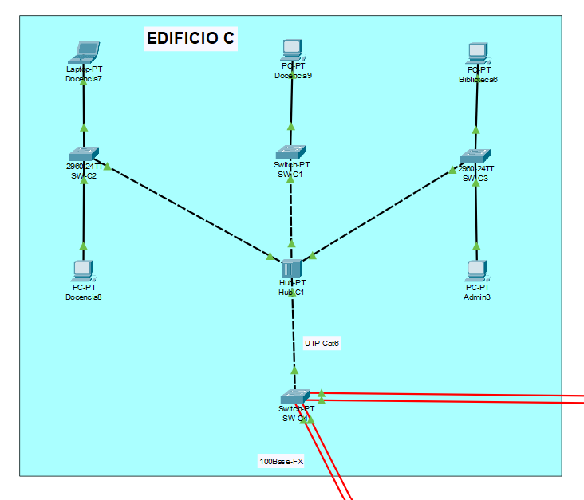

**Estructura:**
- SW-C4 (Switch-PT): Switch de interconexión al campus
- Hub-C1 (Hub-PT): Núcleo del edificio (capa 1) — genera un dominio de colisión compartido
- SW-C1 (Switch-PT): Switch de acceso
- SW-C2 (2960-24TT): Switch de acceso
- SW-C3 (2960-24TT): Switch de acceso

### Edificio D
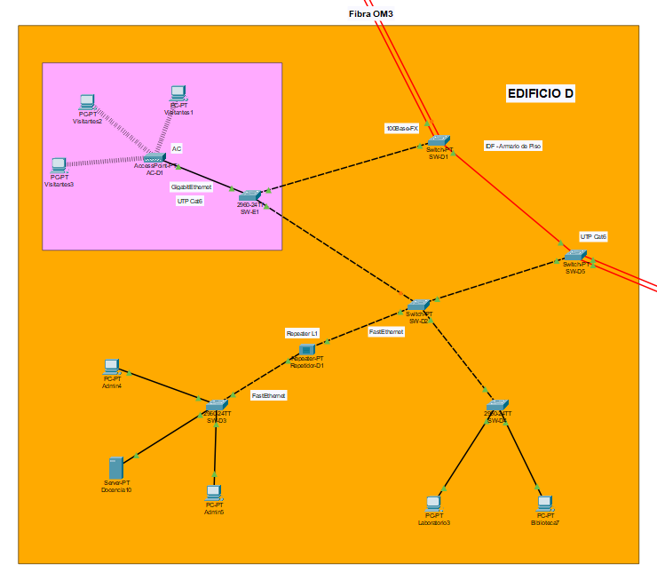

**Estructura:**
- SW-D1 (Switch-PT): IDF / Armario de Piso, interconexión con Edificio C
- SW-D5 (Switch-PT): Interconexión con Edificio B
- SW-D2 (Switch-PT): Distribución interna
- SW-E1 (2960-24TT): VTP Transparent, VLAN Visitantes
- SW-D3 (2960-24TT): Switch de acceso
- SW-D4 (2960-24TT): Switch de acceso
- Repetidor-D1 (Repeater-PT): Extensión física del medio
- AC-D1 (Access Point): Conectividad WiFi para VLAN Visitantes

---

## 3. Tabla de VLANs

| Área | VLAN ID | Nombre VLAN | Red |
|------|---------|-------------|-----|
| Administración | 13 | ADMIN | 192.168.13.0/24 |
| Docencia | 23 | DOCENTES | 192.168.13.0/24 |
| Biblioteca | 33 | BIBLIOTECA | 192.168.13.0/24 |
| Laboratorio | 43 | LABORATORIO | 192.168.13.0/24 |
| Visitantes | 53 | VISITANTE | 192.168.13.0/24 |

---

## 4. Tabla de Direccionamiento IP

### VLAN 13 - ADMIN

| Dispositivo | Edificio | Interfaz | IP | Máscara |
|-------------|----------|----------|-----|---------|
| Admin1 | B | Fa0 | 192.168.13.1 | 255.255.255.0 |
| Admin2 | A | Fa0 | 192.168.13.2 | 255.255.255.0 |
| Admin3 | C | Fa0 | 192.168.13.3 | 255.255.255.0 |
| Admin4 | D | Fa0 | 192.168.13.4 | 255.255.255.0 |
| Admin5 | D | Fa0 | 192.168.13.5 | 255.255.255.0 |

### VLAN 23 - DOCENTES

| Dispositivo | Edificio | Interfaz | IP | Máscara |
|-------------|----------|----------|-----|---------|
| Docencia1 (WiFi) | A | Wireless0 | 192.168.13.51 | 255.255.255.0 |
| Docencia2 | A | Fa0 | 192.168.13.52 | 255.255.255.0 |
| Docencia3 | A | Fa0 | 192.168.13.53 | 255.255.255.0 |
| Docencia6 | B | Fa0 | 192.168.13.54 | 255.255.255.0 |
| Docencia7 | C | Fa0 | 192.168.13.55 | 255.255.255.0 |
| Docencia8 | C | Fa0 | 192.168.13.56 | 255.255.255.0 |
| Docencia9 | C | Fa0 | 192.168.13.57 | 255.255.255.0 |
| Docencia10 | D | Fa0 | 192.168.13.58 | 255.255.255.0 |

### VLAN 33 - BIBLIOTECA

| Dispositivo | Edificio | Interfaz | IP | Máscara |
|-------------|----------|----------|-----|---------|
| Biblioteca1 | B | Fa0 | 192.168.13.101 | 255.255.255.0 |
| Biblioteca2 | B | Fa0 | 192.168.13.102 | 255.255.255.0 |
| Biblioteca3 | B (Hub) | Fa0 | 192.168.13.103 | 255.255.255.0 |
| Biblioteca4 | B (Hub) | Fa0 | 192.168.13.104 | 255.255.255.0 |
| Biblioteca5 | B (Hub) | Fa0 | 192.168.13.105 | 255.255.255.0 |
| Biblioteca6 | C | Fa0 | 192.168.13.106 | 255.255.255.0 |
| Biblioteca7 | D | Fa0 | 192.168.13.107 | 255.255.255.0 |

### VLAN 43 - LABORATORIO

| Dispositivo | Edificio | Interfaz | IP | Máscara |
|-------------|----------|----------|-----|---------|
| Laboratorio2 | A | Fa0 | 192.168.13.151 | 255.255.255.0 |
| Laboratorio3 | D | Fa0 | 192.168.13.152 | 255.255.255.0 |
| Laboratorio4 | A | Fa0 | 192.168.13.153 | 255.255.255.0 |

### VLAN 53 - VISITANTE

| Dispositivo | Edificio | Interfaz | IP | Máscara |
|-------------|----------|----------|-----|---------|
| Visitantes1 (WiFi) | D | Wireless0 | 192.168.13.201 | 255.255.255.0 |
| Visitantes2 (WiFi) | D | Wireless0 | 192.168.13.202 | 255.255.255.0 |
| Visitantes3 (WiFi) | D | Wireless0 | 192.168.13.203 | 255.255.255.0 |

---

## 5. Dominios de Colisión

Cada puerto de un switch genera un dominio de colisión independiente. Los hubs y repetidores comparten un único dominio de colisión entre todos sus puertos.

### Edificio A

| Segmento | Tipo | Dominio de Colisión | Dispositivos |
|----------|------|-------------------|-------------|
| SW-A2 Fa0/3 | Switch | DC-A1 (individual) | Laboratorio2 |
| SW-A2 Fa0/4 | Switch | DC-A2 (individual) | Laboratorio4 |
| SW-A2 Fa0/5 | Switch | DC-A3 (individual) | Admin2 |
| SW-A3 Fa0/3 | Switch | DC-A4 (individual) | AC-A1 |
| SW-A3 Fa0/5 | Switch | DC-A5 (individual) | Docencia2 |
| SW-A3 Fa0/6 | Switch | DC-A6 (individual) | Docencia3 |
| **Total Edificio A** | | **6 dominios de colisión** | |

### Edificio B

| Segmento | Tipo | Dominio de Colisión | Dispositivos |
|----------|------|-------------------|-------------|
| SW-B3 Fa0/2 | Switch | DC-B1 (individual) | Biblioteca1 |
| SW-B3 Fa0/3 | Switch | DC-B2 (individual) | Docencia6 |
| SW-B4 Fa0/2 | Switch | DC-B3 (individual) | Admin1 |
| SW-B4 Fa0/3 | Switch | DC-B4 (individual) | Biblioteca2 |
| Hub-B1 (completo) | Hub | DC-B5 (compartido) | Biblioteca3, Biblioteca4, Biblioteca5, SW-B2 |
| **Total Edificio B** | | **5 dominios de colisión** | |

### Edificio C

| Segmento | Tipo | Dominio de Colisión | Dispositivos |
|----------|------|-------------------|-------------|
| Hub-C1 (completo) | Hub | DC-C1 (compartido) | SW-C4, SW-C1, SW-C2, SW-C3 |
| SW-C1 Fa1/1 | Switch | DC-C2 (individual) | Docencia9 |
| SW-C2 Fa0/2 | Switch | DC-C3 (individual) | Docencia7 |
| SW-C2 Fa0/3 | Switch | DC-C4 (individual) | Docencia8 |
| SW-C3 Fa0/2 | Switch | DC-C5 (individual) | Admin3 |
| SW-C3 Fa0/3 | Switch | DC-C6 (individual) | Biblioteca6 |
| **Total Edificio C** | | **6 dominios de colisión** | |

### Edificio D

| Segmento | Tipo | Dominio de Colisión | Dispositivos |
|----------|------|-------------------|-------------|
| SW-E1 Gig0/1 | Switch | DC-D1 (individual) | AC-D1 |
| Repetidor-D1 | Repeater | DC-D2 (compartido) | SW-D2, SW-D3 (extiende el dominio) |
| SW-D3 Fa0/2 | Switch | DC-D3 (individual) | Admin4 |
| SW-D3 Fa0/3 | Switch | DC-D4 (individual) | Docencia10 |
| SW-D3 Fa0/4 | Switch | DC-D5 (individual) | Admin5 |
| SW-D4 Fa0/2 | Switch | DC-D6 (individual) | Laboratorio3 |
| SW-D4 Fa0/3 | Switch | DC-D7 (individual) | Biblioteca7 |
| **Total Edificio D** | | **7 dominios de colisión** | |

**Total campus: 24 dominios de colisión**

---

## 6. Dominios de Broadcast

Cada VLAN constituye un dominio de broadcast independiente. Como no hay enrutamiento inter-VLAN, existen 5 dominios de broadcast:

| Dominio de Broadcast | VLAN | Dispositivos |
|---------------------|------|-------------|
| DB-1 | VLAN 13 (ADMIN) | Admin1, Admin2, Admin3, Admin4, Admin5 |
| DB-2 | VLAN 23 (DOCENTES) | Docencia1, Docencia2, Docencia3, Docencia6, Docencia7, Docencia8, Docencia9, Docencia10 |
| DB-3 | VLAN 33 (BIBLIOTECA) | Biblioteca1, Biblioteca2, Biblioteca3, Biblioteca4, Biblioteca5, Biblioteca6, Biblioteca7 |
| DB-4 | VLAN 43 (LABORATORIO) | Laboratorio2, Laboratorio3, Laboratorio4 |
| DB-5 | VLAN 53 (VISITANTE) | Visitantes1, Visitantes2, Visitantes3 |

---

## 7. Configuración de Dispositivos

### 7.1 Configuración VTP

| Switch | Modo VTP | Dominio | Contraseña |
|--------|----------|---------|-----------|
| SW-A1 | Server | C7_NetCore | proyecto12026 |
| SW-A2, SW-A3 | Client | C7_NetCore | proyecto12026 |
| SW-B1, SW-B2, SW-B3, SW-B4 | Client | C7_NetCore | proyecto12026 |
| SW-C1, SW-C2, SW-C3, SW-C4 | Client | C7_NetCore | proyecto12026 |
| SW-D1, SW-D2, SW-D3, SW-D4, SW-D5 | Client | C7_NetCore | proyecto12026 |
| SW-E1 | Transparent | C7_NetCore | proyecto12026 |

### 7.2 Configuración STP

- Modo: **Rapid-PVST** (carnet impar)
- Root Bridge: **SW-A1** (prioridad 4096 en todas las VLANs)

### 7.3 Configuración EtherChannel

| Enlace | Medio | Protocolo | Port-Channel | Modo |
|--------|-------|-----------|-------------|------|
| SW-A1 ↔ SW-B1 | Fibra OM3 | PAgP | Po1 | desirable |
| SW-A1 ↔ SW-C4 | Fibra OM3 | PAgP | Po2 | desirable |
| SW-C4 ↔ SW-D1 | Fibra OM3 | PAgP | Po3 | desirable |
| SW-D5 ↔ SW-B2 | Fibra OM3 | PAgP | Po4 | desirable |
| SW-B1 ↔ SW-B2 | Fibra OM3 | PAgP | Po5 | desirable |
| SW-A2 ↔ SW-A3 | UTP Cat6 | LACP | Po6 | active |

### 7.4 Comandos por Dispositivo

#### SW-A1 (VTP Server / Root Bridge)
```
hostname SW-A1
vtp version 2
vtp mode server
vtp domain C7_NetCore
vtp password proyecto12026
vlan 13
 name ADMIN
vlan 23
 name DOCENTES
vlan 33
 name BIBLIOTECA
vlan 43
 name LABORATORIO
vlan 53
 name VISITANTE
spanning-tree mode rapid-pvst
spanning-tree vlan 13 priority 4096
spanning-tree vlan 23 priority 4096
spanning-tree vlan 33 priority 4096
spanning-tree vlan 43 priority 4096
spanning-tree vlan 53 priority 4096
banner motd # Bienvenido a Edificio A - NETCORE_201903873 #
interface range FastEthernet4/1 , FastEthernet5/1
 channel-group 1 mode desirable
interface Port-channel 1
 switchport mode trunk
 switchport trunk allowed vlan 13,23,33,43,53
interface range FastEthernet6/1 , FastEthernet7/1
 channel-group 2 mode desirable
interface Port-channel 2
 switchport mode trunk
 switchport trunk allowed vlan 13,23,33,43,53
interface FastEthernet0/1
 switchport mode trunk
 switchport trunk allowed vlan 13,23,33,43,53
interface FastEthernet1/1
 switchport mode trunk
 switchport trunk allowed vlan 13,23,33,43,53
```

#### SW-A2 (VTP Client)
```
hostname SW-A2
vtp version 2
vtp mode client
vtp domain C7_NetCore
vtp password proyecto12026
spanning-tree mode rapid-pvst
interface GigabitEthernet0/1
 switchport mode trunk
 switchport trunk allowed vlan 13,23,33,43,53
interface range FastEthernet0/1 - 2
 channel-group 6 mode active
interface Port-channel 6
 switchport mode trunk
 switchport trunk allowed vlan 13,23,33,43,53
interface FastEthernet0/3
 switchport mode access
 switchport access vlan 43
interface FastEthernet0/4
 switchport mode access
 switchport access vlan 43
interface FastEthernet0/5
 switchport mode access
 switchport access vlan 13
```

#### SW-A3 (VTP Client)
```
hostname SW-A3
vtp version 2
vtp mode client
vtp domain C7_NetCore
vtp password proyecto12026
spanning-tree mode rapid-pvst
interface GigabitEthernet0/1
 switchport mode trunk
 switchport trunk allowed vlan 13,23,33,43,53
interface range FastEthernet0/1 - 2
 channel-group 6 mode active
interface Port-channel 6
 switchport mode trunk
 switchport trunk allowed vlan 13,23,33,43,53
interface FastEthernet0/3
 switchport mode access
 switchport access vlan 23
```

#### SW-B1 (VTP Client)
```
hostname SW-B1
vtp version 2
vtp mode client
vtp domain C7_NetCore
vtp password proyecto12026
spanning-tree mode rapid-pvst
banner motd # Bienvenido a Edificio B - NETCORE_201903873 #
interface range FastEthernet6/1 , FastEthernet7/1
 channel-group 1 mode desirable
interface Port-channel 1
 switchport mode trunk
 switchport trunk allowed vlan 13,23,33,43,53
interface range FastEthernet4/1 , FastEthernet5/1
 channel-group 5 mode desirable
interface Port-channel 5
 switchport mode trunk
 switchport trunk allowed vlan 13,23,33,43,53
interface FastEthernet0/1
 switchport mode trunk
 switchport trunk allowed vlan 13,23,33,43,53
interface FastEthernet1/1
 switchport mode trunk
 switchport trunk allowed vlan 13,23,33,43,53
```

#### SW-B2 (VTP Client)
```
hostname SW-B2
vtp version 2
vtp mode client
vtp domain C7_NetCore
vtp password proyecto12026
spanning-tree mode rapid-pvst
interface range FastEthernet6/1 , FastEthernet7/1
 channel-group 5 mode desirable
interface Port-channel 5
 switchport mode trunk
 switchport trunk allowed vlan 13,23,33,43,53
interface range FastEthernet4/1 , FastEthernet5/1
 channel-group 4 mode desirable
interface Port-channel 4
 switchport mode trunk
 switchport trunk allowed vlan 13,23,33,43,53
interface FastEthernet0/1
 switchport mode access
 switchport access vlan 33
```

#### SW-B3 (VTP Client)
```
hostname SW-B3
vtp version 2
vtp mode client
vtp domain C7_NetCore
vtp password proyecto12026
spanning-tree mode rapid-pvst
interface GigabitEthernet0/1
 switchport mode trunk
 switchport trunk allowed vlan 13,23,33,43,53
interface FastEthernet0/1
 switchport mode trunk
 switchport trunk allowed vlan 13,23,33,43,53
interface FastEthernet0/2
 switchport mode access
 switchport access vlan 33
interface FastEthernet0/3
 switchport mode access
 switchport access vlan 23
```

#### SW-B4 (VTP Client)
```
hostname SW-B4
vtp version 2
vtp mode client
vtp domain C7_NetCore
vtp password proyecto12026
spanning-tree mode rapid-pvst
interface GigabitEthernet0/1
 switchport mode trunk
 switchport trunk allowed vlan 13,23,33,43,53
interface FastEthernet0/1
 switchport mode trunk
 switchport trunk allowed vlan 13,23,33,43,53
interface FastEthernet0/2
 switchport mode access
 switchport access vlan 13
interface FastEthernet0/3
 switchport mode access
 switchport access vlan 33
```

#### SW-C4 (VTP Client)
```
hostname SW-C4
vtp version 2
vtp mode client
vtp domain C7_NetCore
vtp password proyecto12026
spanning-tree mode rapid-pvst
banner motd # Bienvenido a Edificio C - NETCORE_201903873 #
interface range FastEthernet6/1 , FastEthernet7/1
 channel-group 2 mode desirable
interface Port-channel 2
 switchport mode trunk
 switchport trunk allowed vlan 13,23,33,43,53
interface range FastEthernet4/1 , FastEthernet5/1
 channel-group 3 mode desirable
interface Port-channel 3
 switchport mode trunk
 switchport trunk allowed vlan 13,23,33,43,53
interface FastEthernet0/1
 switchport mode trunk
 switchport trunk allowed vlan 13,23,33,43,53
```

#### SW-C1 (VTP Client)
```
hostname SW-C1
vtp version 2
vtp mode client
vtp domain C7_NetCore
vtp password proyecto12026
spanning-tree mode rapid-pvst
interface FastEthernet0/1
 switchport mode trunk
 switchport trunk allowed vlan 13,23,33,43,53
interface FastEthernet1/1
 switchport mode access
 switchport access vlan 23
```

#### SW-C2 (VTP Client)
```
hostname SW-C2
vtp version 2
vtp mode client
vtp domain C7_NetCore
vtp password proyecto12026
spanning-tree mode rapid-pvst
interface FastEthernet0/1
 switchport mode trunk
 switchport trunk allowed vlan 13,23,33,43,53
interface FastEthernet0/2
 switchport mode access
 switchport access vlan 23
interface FastEthernet0/3
 switchport mode access
 switchport access vlan 23
```

#### SW-C3 (VTP Client)
```
hostname SW-C3
vtp version 2
vtp mode client
vtp domain C7_NetCore
vtp password proyecto12026
spanning-tree mode rapid-pvst
interface FastEthernet0/1
 switchport mode trunk
 switchport trunk allowed vlan 13,23,33,43,53
interface FastEthernet0/2
 switchport mode access
 switchport access vlan 13
interface FastEthernet0/3
 switchport mode access
 switchport access vlan 33
```

#### SW-D1 (VTP Client)
```
hostname SW-D1
vtp version 2
vtp mode client
vtp domain C7_NetCore
vtp password proyecto12026
spanning-tree mode rapid-pvst
banner motd # Bienvenido a Edificio D - NETCORE_201903873 #
interface range FastEthernet5/1 , FastEthernet7/1
 channel-group 3 mode desirable
interface Port-channel 3
 switchport mode trunk
 switchport trunk allowed vlan 13,23,33,43,53
interface FastEthernet4/1
 switchport mode trunk
 switchport trunk allowed vlan 13,23,33,43,53
interface FastEthernet0/1
 switchport mode trunk
 switchport trunk allowed vlan 13,23,33,43,53
```

#### SW-D5 (VTP Client)
```
hostname SW-D5
vtp version 2
vtp mode client
vtp domain C7_NetCore
vtp password proyecto12026
spanning-tree mode rapid-pvst
interface range FastEthernet5/1 , FastEthernet6/1
 channel-group 4 mode desirable
interface Port-channel 4
 switchport mode trunk
 switchport trunk allowed vlan 13,23,33,43,53
interface FastEthernet4/1
 switchport mode trunk
 switchport trunk allowed vlan 13,23,33,43,53
interface FastEthernet0/1
 switchport mode trunk
 switchport trunk allowed vlan 13,23,33,43,53
```

#### SW-D2 (VTP Client)
```
hostname SW-D2
vtp version 2
vtp mode client
vtp domain C7_NetCore
vtp password proyecto12026
spanning-tree mode rapid-pvst
interface FastEthernet1/1
 switchport mode trunk
 switchport trunk allowed vlan 13,23,33,43,53
interface FastEthernet0/1
 switchport mode trunk
 switchport trunk allowed vlan 13,23,33,43,53
interface FastEthernet2/1
 switchport mode trunk
 switchport trunk allowed vlan 13,23,33,43,53
interface FastEthernet3/1
 switchport mode trunk
 switchport trunk allowed vlan 13,23,33,43,53
```

#### SW-E1 (VTP Transparent)
```
hostname SW-E1
vtp version 2
vtp mode transparent
vtp domain C7_NetCore
vtp password proyecto12026
vlan 53
 name VISITANTE
spanning-tree mode rapid-pvst
banner motd # Bienvenido a Edificio D Visitantes - NETCORE_201903873 #
interface FastEthernet0/1
 switchport mode trunk
 switchport trunk allowed vlan 13,23,33,43,53
interface FastEthernet0/2
 switchport mode trunk
 switchport trunk allowed vlan 13,23,33,43,53
interface GigabitEthernet0/1
 switchport mode access
 switchport access vlan 53
```

#### SW-D3 (VTP Client)
```
hostname SW-D3
vtp version 2
vtp mode client
vtp domain C7_NetCore
vtp password proyecto12026
spanning-tree mode rapid-pvst
interface FastEthernet0/1
 switchport mode trunk
 switchport trunk allowed vlan 13,23,33,43,53
interface FastEthernet0/2
 switchport mode access
 switchport access vlan 13
interface FastEthernet0/3
 switchport mode access
 switchport access vlan 23
interface FastEthernet0/4
 switchport mode access
 switchport access vlan 13
```

#### SW-D4 (VTP Client)
```
hostname SW-D4
vtp version 2
vtp mode client
vtp domain C7_NetCore
vtp password proyecto12026
spanning-tree mode rapid-pvst
interface FastEthernet0/1
 switchport mode trunk
 switchport trunk allowed vlan 13,23,33,43,53
interface FastEthernet0/2
 switchport mode access
 switchport access vlan 43
interface FastEthernet0/3
 switchport mode access
 switchport access vlan 33
```

---

## 8. Pruebas de Ping

### VLAN 13 - ADMIN
**Ping exitoso:** Admin1 (192.168.13.1) → Admin2 (192.168.13.2)

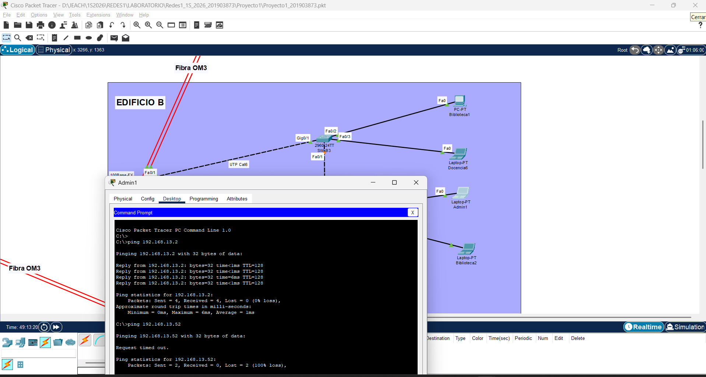

**Ping fallido:** Admin1 (192.168.13.1) → Docencia2 (192.168.13.52) — diferente VLAN, sin conectividad (esperado)

### VLAN 23 - DOCENTES
**Ping exitoso:** Docencia2 (192.168.13.52) → Docencia9 (192.168.13.57)

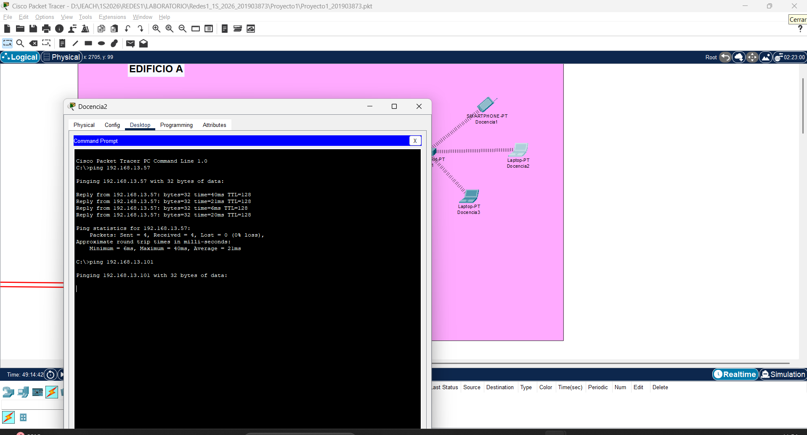

**Ping fallido:** Docencia2 (192.168.13.52) → Biblioteca1 (192.168.13.101) — diferente VLAN, sin conectividad (esperado)

### VLAN 33 - BIBLIOTECA
**Ping exitoso:** Biblioteca1 (192.168.13.101) → Biblioteca6 (192.168.13.106)

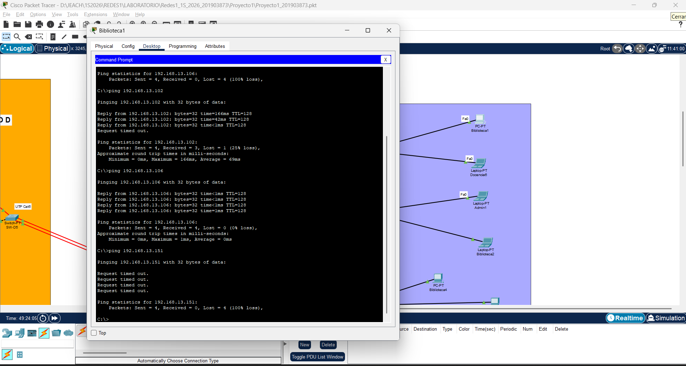

**Ping fallido:** Biblioteca1 (192.168.13.101) → Laboratorio2 (192.168.13.151) — diferente VLAN, sin conectividad (esperado)

### VLAN 43 - LABORATORIO
**Ping exitoso:** Laboratorio2 (192.168.13.151) → Laboratorio3 (192.168.13.152)

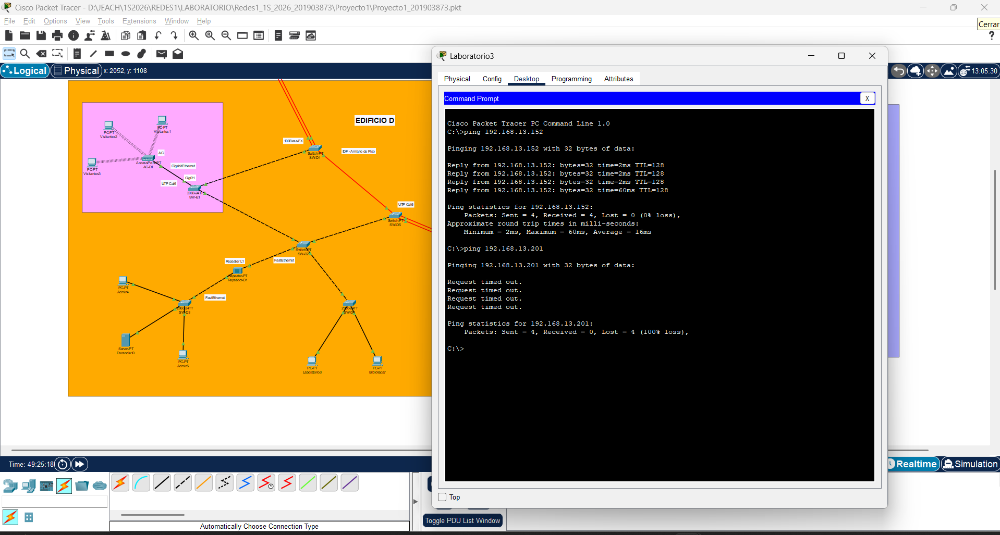

**Ping fallido:** Laboratorio2 (192.168.13.151) → Visitantes1 (192.168.13.201) — diferente VLAN, sin conectividad (esperado)

### VLAN 53 - VISITANTE
**Ping exitoso:** Visitantes1 (192.168.13.201) → Visitantes2 (192.168.13.202)

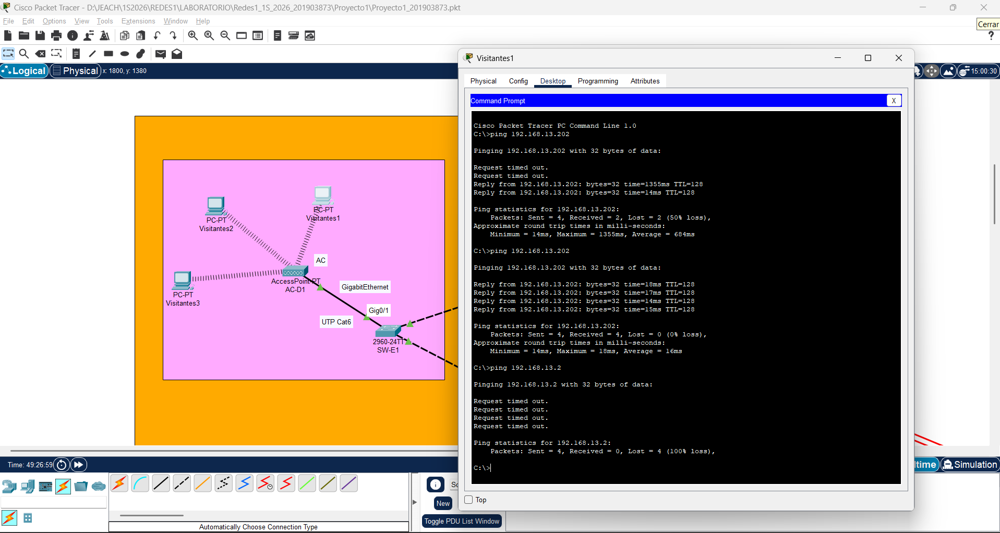

**Ping fallido:** Visitantes1 (192.168.13.201) → Admin2 (192.168.13.2) — diferente VLAN, sin conectividad (esperado)

---

## 9. Capturas de Verificación

### show spanning-tree (SW-A1)
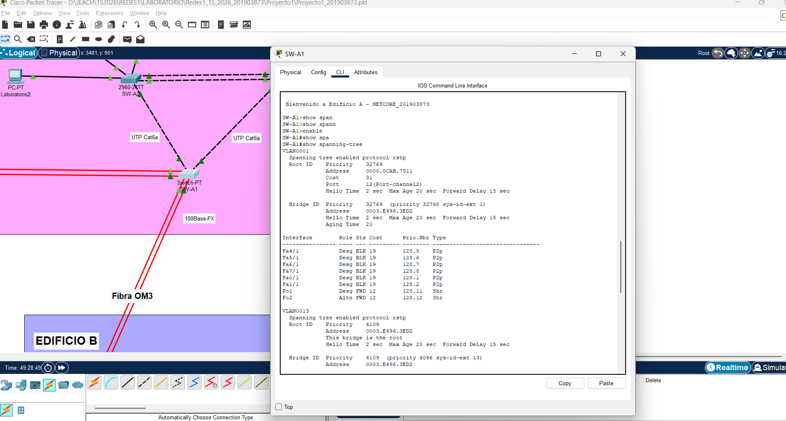

### show etherchannel summary (SW-A1)
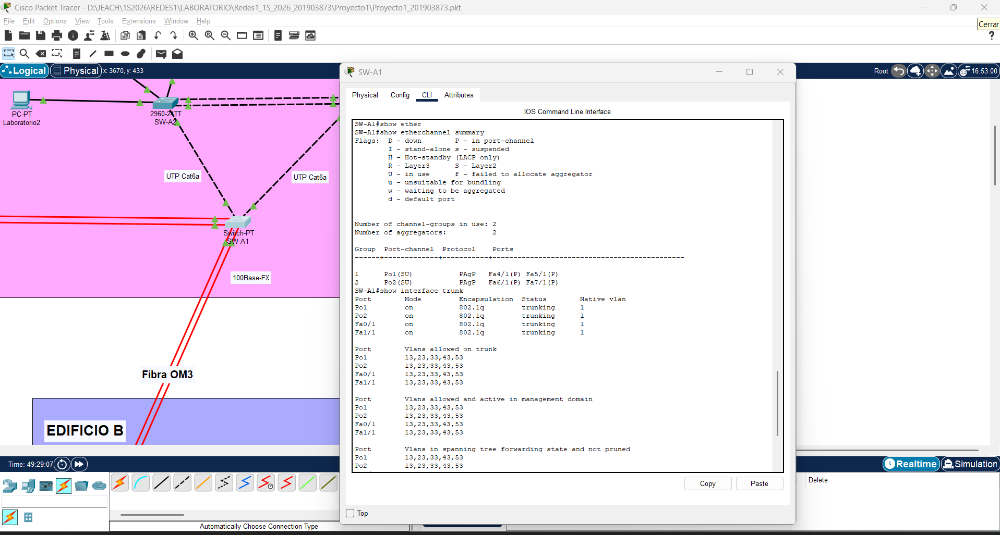

### show interfaces trunk (SW-A1)
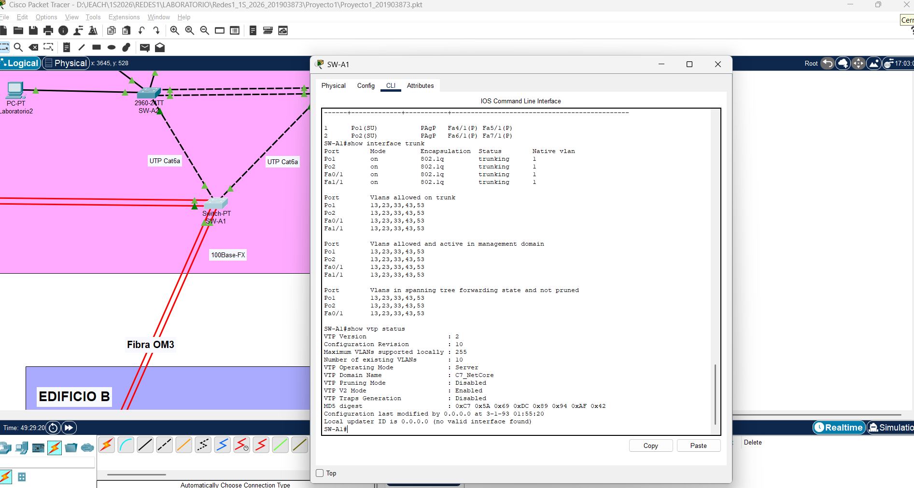

### show spanning-tree (SW-D1)
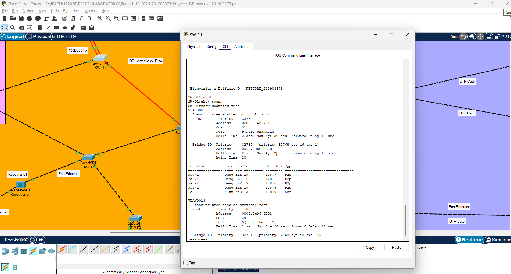

### show etherchannel summary (SW-D1)
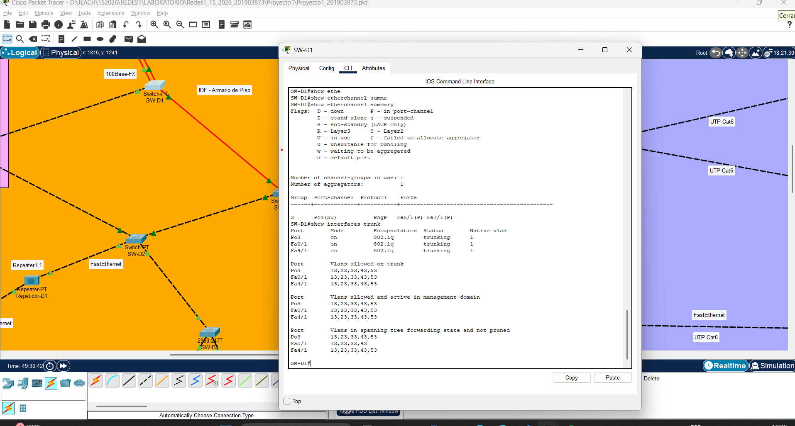

### show interfaces trunk (SW-D1)
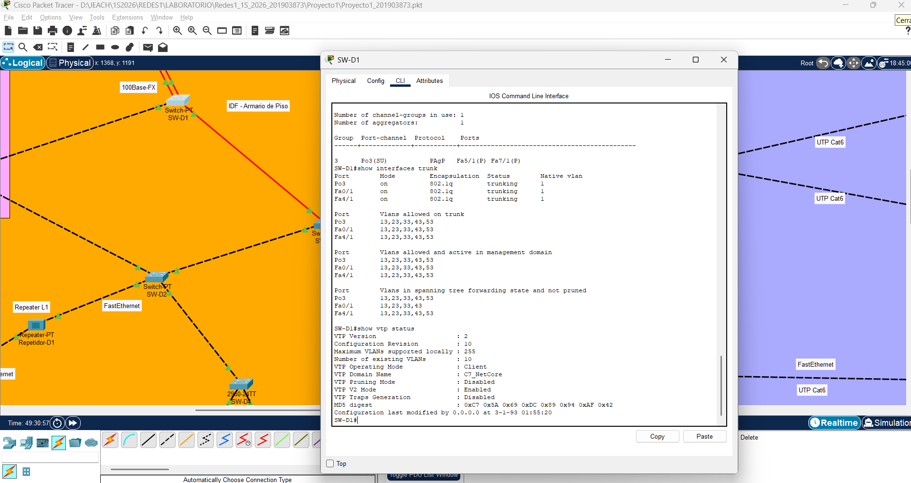

---

## 10. Presupuesto Estimado

Tipo de cambio utilizado: 1 USD ≈ Q 7.68 (marzo 2026)

| Equipo | Cantidad | Precio Unitario (Q) | Total (Q) |
|--------|----------|-------------------|-----------|
| Switch Cisco 2960-24TT | 10 | Q 2,304.00 | Q 23,040.00 |
| Switch genérico (equiv. Switch-PT) | 7 | Q 1,536.00 | Q 10,752.00 |
| Módulo fibra óptica (PT-SWITCH-NM-1FFE) | 22 | Q 1,152.00 | Q 25,344.00 |
| Cable UTP Cat5e (caja 305m) | 2 | Q 614.40 | Q 1,228.80 |
| Cable UTP Cat6 (caja 305m) | 2 | Q 921.60 | Q 1,843.20 |
| Cable fibra óptica OM3 (100m) | 1 | Q 2,304.00 | Q 2,304.00 |
| Conectores RJ-45 (bolsa 100 unidades) | 2 | Q 115.20 | Q 230.40 |
| Conectores de fibra óptica LC | 24 | Q 38.40 | Q 921.60 |
| Hub-PT (Hub genérico) | 2 | Q 230.40 | Q 460.80 |
| Repeater-PT (Repetidor) | 1 | Q 192.00 | Q 192.00 |
| Access Point (Cisco/genérico) | 2 | Q 768.00 | Q 1,536.00 |
| Cables de consola USB-RJ45 | 4 | Q 76.80 | Q 307.20 |
| **TOTAL** | | | **Q 68,160.00** |


---

## Información del Proyecto

| Campo | Valor |
|-------|-------|
| Curso | Redes de Computadoras 1 |
| Semestre | 1S 2026 |
| Sección | A |
| Carnet | 201903873 |
| Nombre | Joaquin Emmanuel Aldair Coromac Huezo |
| Archivo PKT | Proyecto1_201903873.pkt |
| Repositorio | Redes1_1S_2026_201903873 |